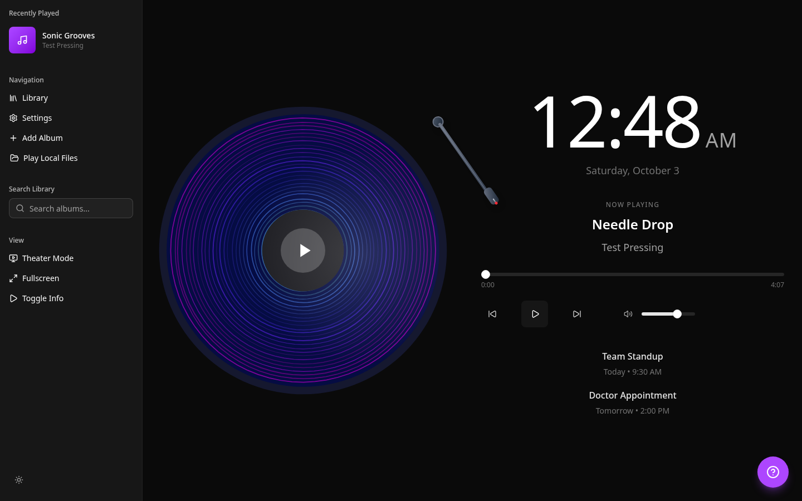

# Spinerr

An ambient music player for a second screen. A generative vinyl record spins with the album you are playing, drawn in real time with p5.js from the audio itself, next to a clock and your upcoming events.

Live: [spinerr-app.web.app](https://spinerr-app.web.app)



- **Generative vinyl.** Groove rings are displaced by seeded Perlin noise per album and by live FFT bands (bass moves amplitude, mids shift colour, highs shimmer). The tone arm follows playback and you can seek by dragging the grooves. The idea is written up in [docs/SONIC_GROOVES_PHILOSOPHY.md](docs/SONIC_GROOVES_PHILOSOPHY.md).
- **Plays your files.** Pick audio files from your computer and they play locally, with ID3 tags and artwork read in the browser. No account or key needed.
- **One search across Audius, SoundCloud, the Internet Archive and live radio**, merged, deduplicated and ranked, with silent fallback. SoundCloud and calendar fetching run as Firebase Cloud Functions (`functions/`). Spotify settings remain but Spotify cannot stream.
- **Dashboard around it.** Clock, upcoming events (sample data for now) and a guided tour. Light and dark themes, a layout that collapses on small screens, theater and fullscreen modes.

## Run it

You need [mise](https://mise.jdx.dev) (it installs Node and pnpm) or Node 24 and pnpm 12.

```bash
git clone https://github.com/alliecatowo/spinerr && cd spinerr
mise install
cd web && pnpm install
pnpm dev            # http://localhost:3000
```

Sign-in and cross-device tour state use Firebase. Without a config the app runs in local-only mode. To enable it, put the web config in `web/.env.local` (never committed; `firebase apps:sdkconfig WEB --project spinerr-app` prints it):

```bash
NEXT_PUBLIC_FIREBASE_API_KEY=...
NEXT_PUBLIC_FIREBASE_AUTH_DOMAIN=...
NEXT_PUBLIC_FIREBASE_PROJECT_ID=...
NEXT_PUBLIC_FIREBASE_STORAGE_BUCKET=...
NEXT_PUBLIC_FIREBASE_MESSAGING_SENDER_ID=...
NEXT_PUBLIC_FIREBASE_APP_ID=...
```

## Develop

```bash
cd web
pnpm lint         # ESLint (next/core-web-vitals + typescript)
pnpm typecheck
pnpm test         # Vitest
pnpm build        # static export to web/out for Firebase Hosting (build:static is an alias)
```

CI runs all of the above on every push and pull request. Dependabot keeps `web/` and the workflows current and auto-merges patch and minor updates once CI is green.

## Deploy

Hosting is Firebase, from the static export. `NEXT_PUBLIC_*` values are baked in at build time, so deploy from a checkout that has `web/.env.local`:

```bash
cd web && pnpm build:static && cd ..
pnpm dlx firebase-tools deploy --only hosting,firestore:rules --project spinerr-app
```

## Layout

| Path | What |
| --- | --- |
| `web/src/app` | Next.js App Router pages (static export). Proxies live in `functions/` |
| `web/src/components` | `music/` (vinyl, tone arm, controls), `calendar/`, `library/`, `settings/`, `layout/`, shadcn `ui/` |
| `web/src/lib` | Zustand stores, the p5 vinyl sketch, audio player and analyzer, music sources (Audius, SoundCloud, Internet Archive, radio, local) |
| `firestore.rules`, `firebase.json` | Firebase Hosting and security rules |

## License

[MIT](LICENSE)
